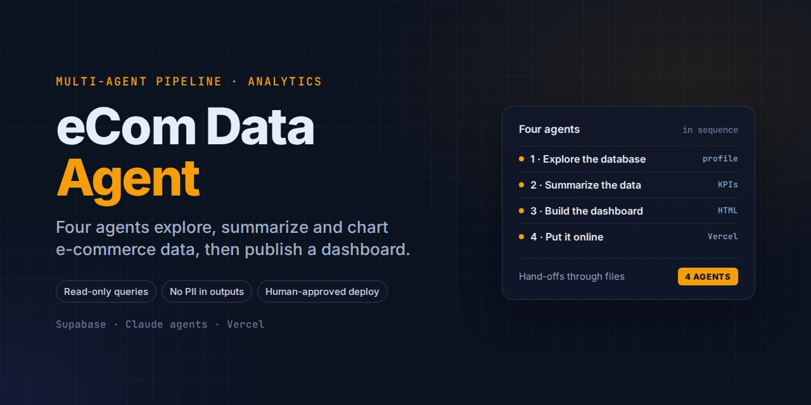
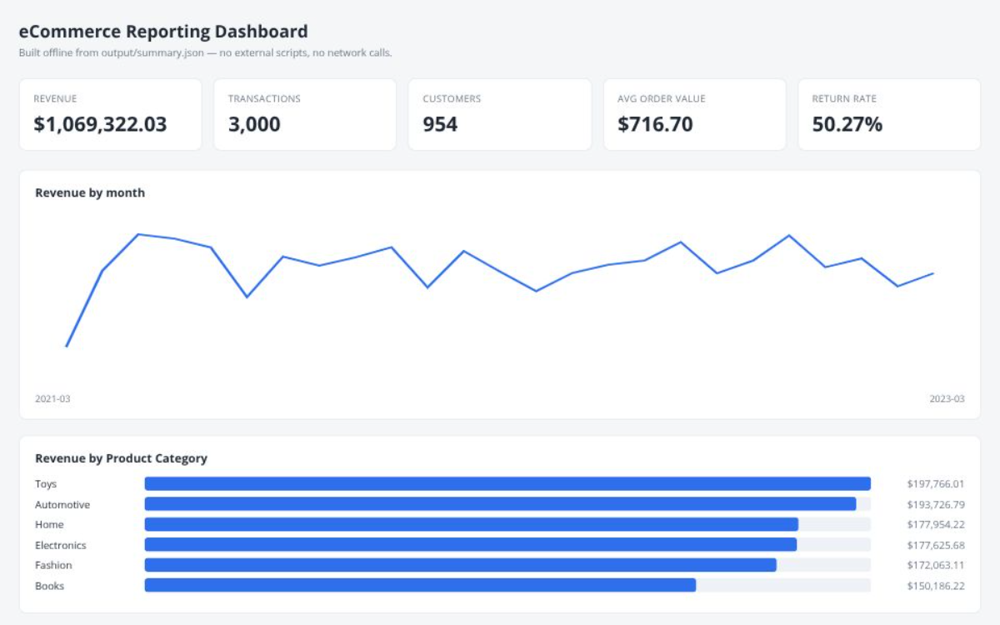

# eCom Data Agent

A four-agent pipeline that explores, summarizes, and visualizes e-commerce data from Supabase, then optionally publishes the result as a dashboard on Vercel. Agents run one at a time and hand work to each other through files, not chat.

**Live dashboard:** [ecommerce-analytics-dashboard-brown-xi.vercel.app](https://ecommerce-analytics-dashboard-brown-xi.vercel.app)

## The four agents

| Agent | Job | Writes |
|---|---|---|
| [1 · Explore the database](agents/agent1.md) | Profiles both tables, checks the customer link, counts nulls, reports distinct values | `output/schema_report.md`, `output/schema.json` |
| [2 · Summarize the data](agents/agent2.md) | Turns the data into KPIs, trends, segments and flags | `output/summary.md`, `output/summary.json` |
| [3 · Build the dashboard](agents/agent3.md) | Renders `summary.json` as a single offline HTML file with hand-drawn charts (no CDN, no fetch) | `dashboard/index.html`, `output/dashboard_notes.md` |
| [4 · Put it online](agents/agent4.md) | Checks the dashboard for personal data and credentials, then deploys to Vercel after human confirmation | `output/deploy_report.md` |

The shared rules every agent follows are in [CLAUDE.md](CLAUDE.md).

## Data

Two tables in Supabase Postgres: `customers` (1,000 rows) and `transactions` (3,000 rows). The sample data in [customers1.csv](customers1.csv) and [transactions1.csv](transactions1.csv) is synthetic.

## Guardrails

- **Read only.** No agent ever inserts, updates, deletes or alters data.
- **No personal data in outputs.** Names, emails and phone numbers never appear in `output/`, the dashboard, or anything published. Results use counts and group sizes only.
- **Human in the loop.** Deployment happens only after a person confirms, and any unexpected result stops the pipeline for review instead of being guessed around.
- **Query pitfalls handled.** Mixed-case column names are always quoted, and the text date column is converted before any date math.

## Outputs in this repo

- [output/](output/): schema report, data summary, dashboard notes and deploy report from a full run
- [dashboard/index.html](dashboard/index.html): the generated dashboard
- [deployment/privacy_audit.md](deployment/privacy_audit.md): the pre-publish privacy check
